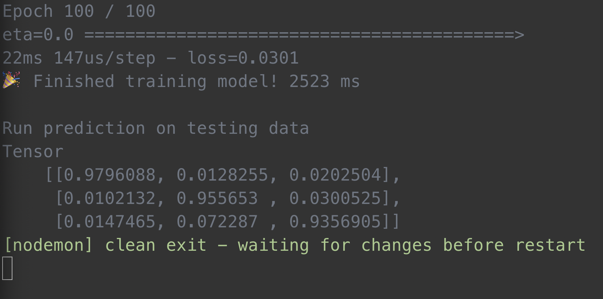

# TensorFlow JS Tutorial

Build a neural network with TensorFlow for Beginners

- https://www.youtube.com/watch?v=XdErOpUzupY
- https://gist.github.com/learncodeacademy/a96d80a29538c7625652493c2407b6be

# Install and run

- `yarn`
- `yarn start`
